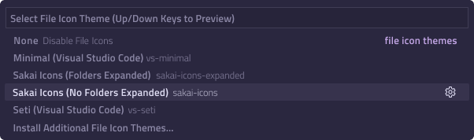

<h1>Sakai Icons</h1>

<h4>A Icons Theme for Visual Studio Code</h4>

Pick your favorite theme and have fun! 🎉

_Note: For file names, you can use `*` to match all files with a specific file extension._

### Icon Previews

You can choose which icons to use from the [Library](https://www.figma.com/design/38itAxU9UwS4cK8YS2u716/Sakai-Icons?t=o7Q02zK9c7C9XGWT-1):
