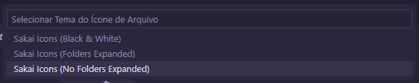

<h1>Sakai Icons</h1>

<h4>A Icons Theme for Visual Studio Code</h4>

Pick your favorite theme and have fun! 🎉

## Contributing

If you would like to contribute to this extension, please take a look at the issues or create a new one. If you want to create a new icon, see the [Sakai Icons](https://www.figma.com/design/38itAxU9UwS4cK8YS2u716/Sakai-Icons?t=o7Q02zK9c7C9XGWT-1) file, you can make a copy or reference the styles used (tailwind). Try limiting your colors to those used in existing icons before choosing a different color style.

When submitting a PR, make sure you have tested the extension locally and that your new icons appear correctly in the file tree view with your new file extension. Please include a screenshot of the proposed icon in your PR.

### Icon Previews

You can choose which icons to use from the [Library](https://www.figma.com/design/38itAxU9UwS4cK8YS2u716/Sakai-Icons?t=o7Q02zK9c7C9XGWT-1):